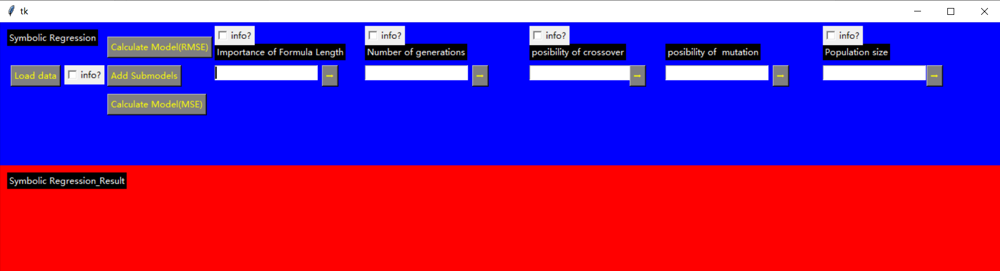
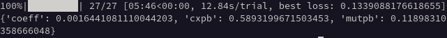

# Hyperparameter Optimization (HPO) for Symbolic Regression <!-- omit in toc -->

This is the code and the data set necessary to reproduce the results from the the dissertation "Modellbildung mittels Symbolischer Regression zur Messunsicherheitsbestimmung komplexer Messprozesse". 

Author: Mueller, Tobias 

Chair of Production Metrology and Quality Management at the Laboratory for Machine Tools and Production Engineering (WZL) of RWTH Aachen University - Campus Boulevard 30, 52074 Aachen, Germany

Please cite this code or the data set as: BibTex will be added after publication 

Given the population size and the number of generations, the symbolic regression has the following three hyperparameters: 
- importance of formula length
- probability of crossover
- probability of mutation
 
 The software in this repository contains four algorithms to find optimal values for these hyperparameters automatically. The four algorithms are:
 1. Grid Search
 2. Random Search
 3. Bayesian Optimization via a Gaussian Process (GP)
 4. Bayesian Optimization via a Tree-Structured Parzen Estimator (TPE)

# Table of Contents <!-- omit in toc -->
- [Installation](#installation)
- [Supported Data Format](#supported-data-format)
- [Usage](#usage)
  - [Load Data](#load-data)
  - [Hyperparameter Optimization (HPO)](#hyperparameter-optimization-hpo)
- [Example: CT Scan](#example-ct-scan)
- [Example: Ultrasound](#example-ultrasound)
- [License](#license)

# Installation

The installation procedure here is the same as for the symbolic regression itself. Thus, please follow the installation steps described there: https://github.com/tmueller1/symbolic-regression#installation.

# Supported Data Format

The supported data format is described under: https://github.com/tmueller1/symbolic-regression#supported-data-format.

# Usage

Before the HPO algorithm can be applied, a dataset has to be selected.

## Load Data

1. Run load_data.py, e.g. via the command `python load_data.py`.
2. Click on "Load data" in the window that pops up and select supported data to perform the HPO on: 
3. Close the window.

## Hyperparameter Optimization (HPO)

As already explained above, this repository contains four HPO algorithms. The corresponding Python files are called grid_search.py, random_search.py, bayesian_optimization_gp.py, and bayesian_optimization_tpe.py.

1. To change the number of tried hyperparameter combinations, the interval of the hyperparameters, the population size, or the number of generations, please have a look at the .py file, and follow the instructions in the comments there.
2. Run the HPO algorithm, e.g. via the command `python grid_search.py`.
3. The process of the HPO algorithm is displayed in the terminal. When the algorithm has finished, the hyperparameter combination ("coeff": importance of formula length, "cxpb": probability of crossover, "mutpb": probability of mutation) with the lowest RMSE ("best loss") is displayed: 

# Example: CT Scan

For the CT scan data after the feature selection (see https://github.com/tmueller1/Feature-Selection-For-Measurement-Models), a HPO using the Bayesian optimization via TPE with the following **settings** is conducted:
- number of trials: 54
- population size: 100
- number of generations: 100
- importance of formula length: from 0.00000001 to 0.000001
- probability of crossover: from 0.5 to 1.0
- probability of mutation: from 0.2 to 0.5

The result are the following **optimal hyperparameters**:
- importance of formula length: 0.000000162
- probability of crossover: 0.864293387948539
- probability of mutation: 0.209602872371429

# Example: Ultrasound

The same procedure with exactly the **same settings as above** for the ultrasound data after the feature selection leads to the following **optimal hyperparameters**:
- importance of formula length: 0.00000048020577708636
- probability of crossover: 0.782286936452065
- probability of mutation: 0.270320848994761

# License

Copyright 2022 Tobias Mueller - RWTH Aachen Univerity - Laboratory for Machine Tools and Production Engineering WZL of RWTH Aachen

Redistribution and use in source and binary forms, with or without modification, are permitted provided that the following conditions are met:

1. Redistributions of source code must retain the above copyright notice, this list of conditions and the following disclaimer.
2. Redistributions in binary form must reproduce the above copyright notice, this list of conditions and the following disclaimer in the documentation and/or other materials provided with the distribution.
3. Neither the name of the copyright holder nor the names of its contributors may be used to endorse or promote products derived from this software without specific prior written permission.

THIS SOFTWARE IS PROVIDED BY THE COPYRIGHT HOLDERS AND CONTRIBUTORS "AS IS" AND ANY EXPRESS OR IMPLIED WARRANTIES, INCLUDING, BUT NOT LIMITED TO, THE IMPLIED WARRANTIES OF MERCHANTABILITY AND FITNESS FOR A PARTICULAR PURPOSE ARE DISCLAIMED. IN NO EVENT SHALL THE COPYRIGHT HOLDER OR CONTRIBUTORS BE LIABLE FOR ANY DIRECT, INDIRECT, INCIDENTAL, SPECIAL, EXEMPLARY, OR CONSEQUENTIAL DAMAGES (INCLUDING, BUT NOT LIMITED TO, PROCUREMENT OF SUBSTITUTE GOODS OR SERVICES; LOSS OF USE, DATA, OR PROFITS; OR BUSINESS INTERRUPTION) HOWEVER CAUSED AND ON ANY THEORY OF LIABILITY, WHETHER IN CONTRACT, STRICT LIABILITY, OR TORT (INCLUDING NEGLIGENCE OR OTHERWISE) ARISING IN ANY WAY OUT OF THE USE OF THIS SOFTWARE, EVEN IF ADVISED OF THE POSSIBILITY OF SUCH DAMAGE.
