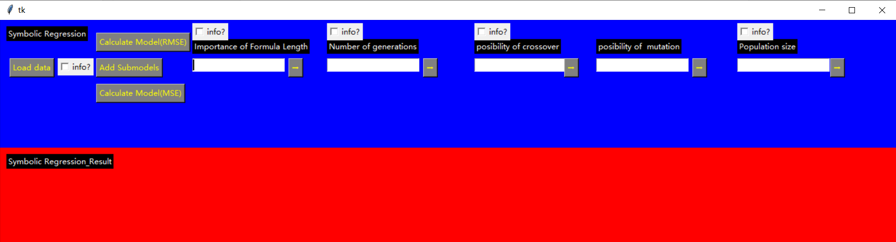

# Hyperparameter Optimization (HPO) for Symbolic Regression <!-- omit in toc -->

Given the population size and the number of generations, the symbolic regression has the following three hyperparameters: 
- importance of formula length
- probability of crossover
- probability of mutation
 
 The software in this repository contains four algorithms to find optimal values for these hyperparameters automatically. The four algorithms are:
 1. Grid Search
 2. Random Search
 3. Bayesian Optimization via a Gaussian Process (GP)
 4. Bayesian Optimization via a Tree-Structured Parzen Estimator (TPE)

# Table of Contents <!-- omit in toc -->
- [Installation](#installation)
- [Supported Data Format](#supported-data-format)
- [Usage](#usage)
  - [Load Data](#load-data)
  - [Hyperparameter Optimization (HPO)](#hyperparameter-optimization-hpo)
- [Example: CT Scan](#example-ct-scan)
- [Example: Ultrasound](#example-ultrasound)

# Installation

The installation procedure here is the same as for the symbolic regression itself. Thus, please follow the installation steps described there: https://git-ce.rwth-aachen.de/wzl-mq-ms-rpc/code/research/mlb-dissertation/symbolic-regression#installation.

# Supported Data Format

The supported data format is described under: https://git-ce.rwth-aachen.de/wzl-mq-ms-rpc/code/research/mlb-dissertation/symbolic-regression#supported-data-format.

# Usage

## Load Data

1. Run load_data.py, e.g. via the command `python load_data.py`.
2. Click on "Load data" in the window that pops up and select supported data: 
3. Close the window.

## Hyperparameter Optimization (HPO)

As already explained above, this repository contains four HPO algorithms. The corresponding Python files are called grid_search.py, random_search.py, bayesian_optimization_gp.py, and bayesian_optimization_tpe.py. Although the following steps are explained w.r.t. a grid search, the other algorithms can be applied in the same way.

1. To change the number of tried hyperparameter combinations, the interval of the hyperparameters, the population size, or the number of generations, please have a look at the .py file, and follow the instructions in the comments there.
2. Run the HPO algorithm, e.g. via the command `python grid_search.py`.
3. The process of the HPO algorithm is displayed in the terminal. When the algorithm has finished, the hyperparameter combination with the lowest RMSE is displayed. This is the result of the HPO algorithm. 

# Example: CT Scan

For the CT scan data after the feature selection (see https://git-ce.rwth-aachen.de/wzl-mq-ms-rpc/code/research/mlb-dissertation/feature-selection-for-measurement-models), a HPO using the Bayesian optimization via TPE with the following **settings** is conducted:
- number of trials: 54
- population size: 100
- number of generations: 100
- importance of formula length: from 0.00000001 to 0.000001
- probability of crossover: from 0.5 to 1.0
- probability of mutation: from 0.2 to 0.5

The result are the following ++optimal hyperparameters**:
- importance of formula length: 0.000000162
- probability of crossover: 0.864293387948539
- probability of mutation: 0.209602872371429

# Example: Ultrasound

The same procedure with exactly the **same settings as above** for the ultrasound data after the feature selection leads to the following **optimal hyperparameters**:
- importance of formula length: 0.00000048020577708636
- probability of crossover: 0.782286936452065
- probability of mutation: 0.270320848994761